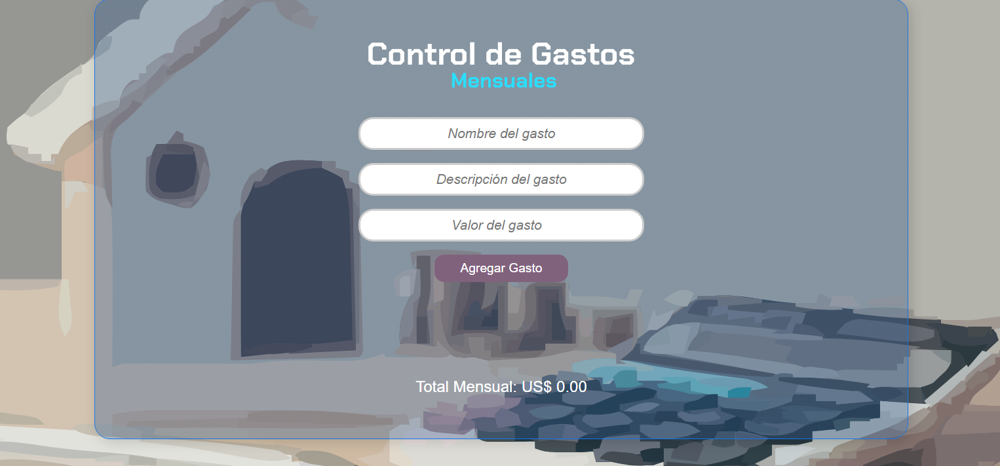

# Gestor de Gastos Personal :memo:
## ¡Domina tus finanzas con esta sencilla aplicación!

Este proyecto, creado como parte del curso "Inmersión Dev con Javascript" de Alura Latam, te permite llevar un control efectivo de tus gastos mensuales.

### **¡Desafíos de esta clase!** :muscle:
1. Generar un mensaje de alerta cuando se registre un gasto mayor a *150$ dólares*. :dollar:
2. Agregar un nuevo campo donde se pueda colocar una *descripción* más detallada del gasto. :page_with_curl:
3. Agregar un botón que permita *modificar* los gastos registrados. :black_nib:

### ¿Qué hace? :interrobang:
- Registra gastos: Agrega nuevos gastos de manera fácil e intuitiva. :heavy_check_mark:
- Modifica gastos: Edita la información de los gastos existentes. :heavy_check_mark:
- Elimina gastos: Elimina los gastos que ya no sean necesarios. :heavy_check_mark:
- Calcula totales: Obtén una visión general de tus gastos con el cálculo automático del total. :heavy_check_mark: 
- Valida datos: Evita errores al ingresar datos no válidos (por ejemplo, valores numéricos negativos). :heavy_check_mark:
- Personaliza tus gastos: Agrega descripciones detalladas para cada gasto. :heavy_check_mark:

### Instalación y uso :wrench:
1. Clona el repositorio:
	```
    Bash git clone https://github.com/Magui2608/Control-gastos-mensuales.git
    ```

2.	Abre el archivo HTML: Abre el archivo HTML correspondiente en tu navegador web.

### Contribuciones :sparkler:
**¡Las contribuciones son bienvenidas!** Si encuentras algún error o deseas agregar nuevas funcionalidades, por favor, crea un issue o un pull request en el repositorio.

### Tecnologías utilizadas :computer:
- JavaScript: Lenguaje de programación principal.
- HTML: Estructura de la página web.
- CSS: Estilos visuales de la página.

**¡Comienza a controlar tus gastos hoy mismo!**


